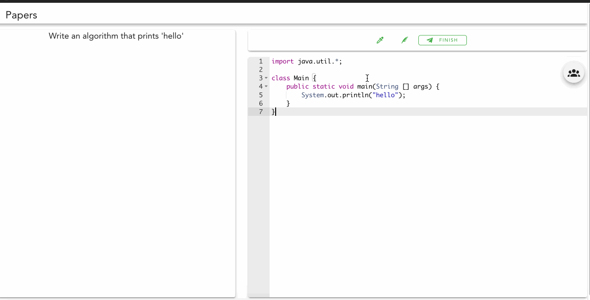

# Papers :page_facing_up:

A platform were you can practice your coding skills by competing with other people! <br />
**Still in Progress!**



## Getting Started

These instructions will get you a copy of the project up and running on your local machine for development and testing purposes. See deployment for notes on how to deploy the project on a live system.

### Prerequisites

You will need the following dependencies to run the development environment:

```
Node.js
Redis
Docker
MongoDB
```

### Installing

A step by step series of examples that tell you how to get a development env running .... soon!


## Deployment

Also will add notes here soon!

## Other technologies

* [Judge0](https://github.com/judge0/api) - Code judge
* [Vuetify](https://vuetifyjs.com/en/) - Material Component Framework
* [Socket.io](https://socket.io/) - WebSocket connections
* AWS SES - Automated email sender for user registration

## Authors

* **Steven Zhu** - *Sole Developer*


## License

MIT

## Acknowledgments

* The creators of some of the code I used
